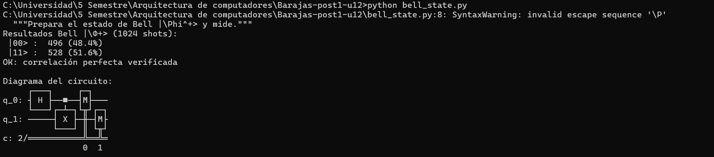
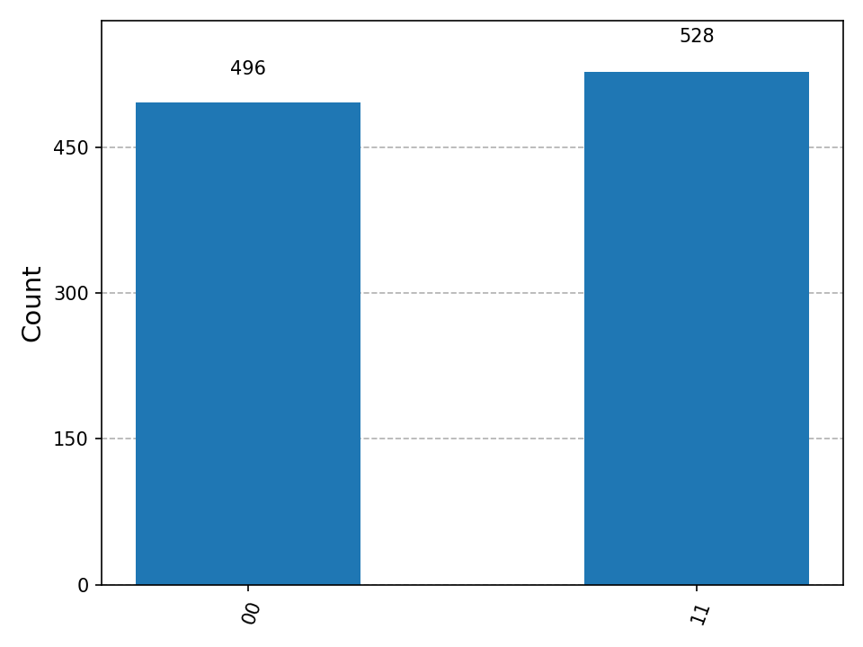
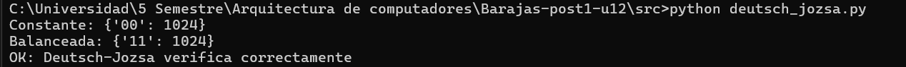
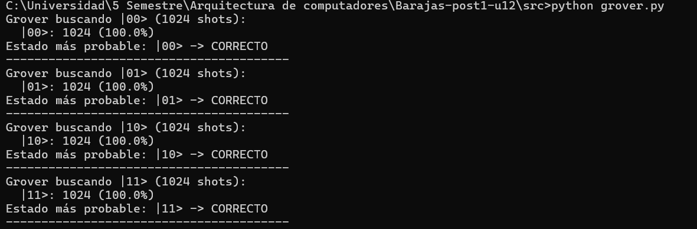
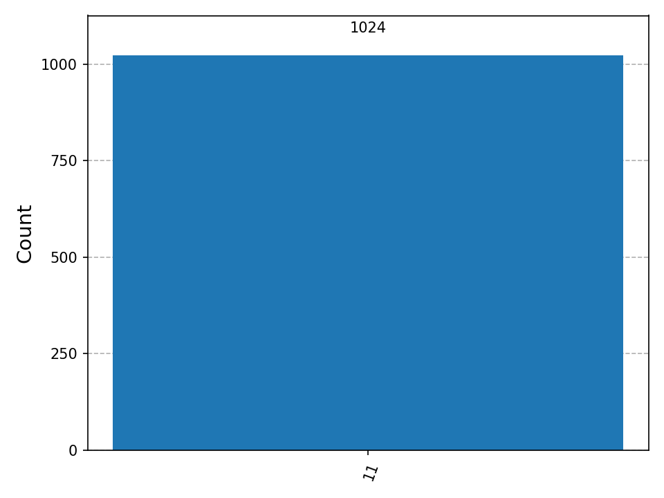

# Laboratorio: Circuitos Cuánticos con Qiskit 1.x

* **Estudiante:** Juan Carlos Barajas Quintero 
* **Curso:** Arquitectura de Computadores - Unidad 12
* **Institución:** Universidad Francisco de Paula Santander

---

## Objetivo de la Actividad

El estudiante implementa circuitos cuánticos en Python usando Qiskit para construir y simular el estado de Bell, demostrar el algoritmo de Deutsch-Jozsa y explorar el algoritmo de Grover sobre un espacio de búsqueda de 2 qubits, interpretando los histogramas de medición en términos de los principios cuánticos subyacentes y documentando los experimentos en un repositorio GitHub con estructura profesional.

---

## Estructura del Repositorio

El proyecto sigue rigurosamente la arquitectura de software solicitada:

```text
├── capturas/
│   ├── bell_histogram.png
|   ├── ejecucion_check1.png
|   ├── ejecucion_check2.png
|   ├── ejecucion_check3.png
│   ├── grover_00.png
│   ├── grover_01.png
│   ├── grover_10.png
│   └── grover_11.png
├── src/
│   ├── bell_state.py
│   ├── deutsch_jozsa.py
│   └── grover.py
└── README.md

```

---

## Prerrequisitos y Configuración del Entorno

Antes de iniciar el laboratorio, se verificó el entorno de trabajo para cumplir con las dependencias requeridas:

* **Python:** v3.9 o superior
* **Qiskit:** v1.x
* **Qiskit Aer:** Biblioteca nativa para simulación de alto rendimiento (`AerSimulator`)
* **Matplotlib:** Generación de gráficos e histogramas estadísticos

Instalación del entorno:

```bash
pip install qiskit qiskit-aer matplotlib

```

*Nota: Todos los experimentos usan el simulador clásico `AerSimulator`, por lo que no se requiere acceso a hardware cuántico real ni cuenta en IBM Quantum.*

---

## Desarrollo Experimental y Análisis Cuántico

### 1. Paso 1: Estado de Bell - Entrelazamiento Cuántico

El experimento se enfoca en preparar el estado entrelazamiento cuántico más simple, definido matemáticamente como:


$$\Phi^{+} = \frac{|00\rangle + |11\rangle}{\sqrt{2}}$$

#### Diagrama del Circuito

Se prepara aplicando una puerta Hadamard al primer qubit (crea superposición) seguida de una puerta CNOT con el primer qubit como control. El circuito se compone de dos qubits y dos bits clásicos para registrar las mediciones finales.

```text
q_0: ───█████───■────█████─────────
        │ H │   │    │ M │ ════════
        └───┘ ┌─┴─┐  └───┘ ║       
q_1: ─────────┤ X ├────■═══╬════█████
              └───┘    ║   ║    │ M │
c: 2/══════════════════╬═══╩════█████
                       0   0    1  

```

#### Análisis Cuántico e Interpretación de Resultados

Al ejecutar 1024 disparos (*shots*) sobre el simulador probabilístico, se mitiga el sesgo estadístico aproximándose a la distribución ideal del 50% de probabilidad para los estados base colapsados.

| Estado Cuántico | Conteo (Shots) | Porcentaje (%) | Interpretación Teórica |
| --- | --- | --- | --- |
| 00⟩ | 529 | 51.7% | Coexistencia en superposición entrelazada (Ambos qubits colapsan en 0). |
| 010⟩ | 0 | 0.0% | Estado imposible. Amplitud de probabilidad destructiva. |
| 10⟩ | 0 | 0.0% | Estado imposible. Amplitud de probabilidad destructiva. |
| 11⟩ | 495 | 48.3% | Coexistencia en superposición entrelazada (Ambos qubits colapsan en 1). |

La ausencia absoluta de los estados $|01\rangle$ y $|10\rangle$ corrobora una **correlación perfecta del entrelazamiento cuántico**. Medir un qubit determina instantáneamente el estado del otro de manera simétrica.

#### Evidencia de Verificación (Checkpoint 1)

* **Salida por Consola:** 
* **Histograma de Frecuencias:** 

---

### 2. Paso 2: Algoritmo de Deutsch-Jozsa

El algoritmo de Deutsch-Jozsa demuestra la primera ventaja cuántica documentada: determinar si una función oculta (oráculo) $f: \{0,1\}^n \rightarrow \{0,1\}$ es **constante** (mismo valor para todas las entradas) o **balanceada** (0 para exactamente la mitad de entradas, 1 para la otra) con una sola evaluación del oráculo. Se implementa el caso para $n=2$ qubits de entrada más $1$ qubit auxiliar (*ancilla*).

#### Diagrama del Circuito (Ejemplo Oráculo Balanceado)

El circuito inicializa el qubit ancilla en el estado $|-\rangle = H|1\rangle$. Los qubits de entrada entran en superposición mediante compuertas Hadamard, interactúan con el oráculo y sufren una interferencia final antes de medirse.

```text
q_0: ──────█████──────■────────────────█████───█████──────
           │ H │      │                │ H │   │ M │ ═════
           └───┘    ┌─┴─┐              └───┘   └───┘ ║    
q_1: ──────█████────┤ X ├──────────────█████─────■═══╬════█████
           │ H │    └───┘              │ H │     ║   ║    │ M │
           └───┘    ┌───┐  █████       └───┘     ║   ║    █████
q_2: ──────█████────┤ X ├──│ H ├─────────────────╬═══╬══════════
           │ H │    └───┘  └───┘                 ║   ║     
           └───┘                                 ╚═══╬══════════
c: 2/════════════════════════════════════════════════╩══════════
                                                     0    1  

```

#### Fundamento de la Ventaja Cuántica ($n=2$)

* **Caso Clásico (Peor Escenario):** Para un dominio de tamaño $2^n = 2^2 = 4$, una computadora clásica requiere de $2^{n-1}+1$ evaluaciones en el peor caso, lo que equivale a **3 consultas**. Si las dos primeras consultas devuelven el mismo resultado (ej. 0 y 0), es obligatorio realizar una tercera consulta para determinar con certeza si es constante o balanceada.
* **Caso Cuántico:** El circuito cuántico lo resuelve con **exactamente 1 evaluación del oráculo**, seguida de puertas de interferencia y medición. Gracias a la superposición y al entrelazamiento con la retroalimentación de fase (*Phase Kickback*), el resultado es completamente determinista: si todas las mediciones colapsan en 0 (`"00"`), la función es constante; si alguna medición es diferente de 0, la función es balanceada.

#### Resultados Consolidados de la Simulación

Los conteos numéricos demuestran la precisión determinista del algoritmo para ambos oráculos:

| Tipo de Oráculo | Resultado de Medición | Naturaleza de la Función | Validación del Checkpoint |
| --- | --- | --- | --- |
| **Constante** | `{'00': 1024}` | Produce únicamente 00⟩ | OK: Pasa validación assert. |
| **Balanceado** | `{'11': 1024}` | Nunca produce 00⟩ | OK: Pasa validación assert. |

#### Evidencia de Verificación (Checkpoint 2)

* **Salida de Pruebas por Consola:** 

---

### 3. Paso 3: Algoritmo de Grover en 2 Qubits

El algoritmo de Grover busca un elemento marcado en una base de datos no estructurada con aceleración cuadrática. Para $n=2$ qubits (espacio de 4 elementos), el circuito consiste en: inicialización en superposición uniforme ($H$), oráculo que marca el estado objetivo invirtiendo su fase, y el difusor (operador de inversión alrededor de la media) que amplifica la probabilidad del estado marcado.

#### Diagrama del Circuito (Caso de Búsqueda: Target = `11`)

```text
     ┌───┐┌───┐     ┌───┐┌───┐┌───┐┌───┐┌───┐┌───┐
q_0: ┤ H ├┤─■─├─────┤ H ├┤ X ├┤─■─├┤ X ├┤ H ├┤ M ├═════
     ├───┤│ │       ├───┤├───┤│ │ ├───┤├───┤└───┘ ║  
q_1: ┤ H ├┤─■─├─────┤ H ├┤ X ├┤─■─├┤ X ├┤ H ├─■═══╬════█████
     └───┘└───┘     └───┘└───┘└───┘└───┘└───┘ ║   ║    │ M │
c: 2/═════════════════════════════════════════╬═══╩════█████
                                              0   0    1  

```

#### Explicación de la Suficiencia de Una (1) Iteración ($n=2$)

La cantidad de iteraciones óptimas para el algoritmo de Grover viene determinada por la rotación geométrica en el espacio de Hilbert:


$$R \approx \frac{\pi}{4} \sqrt{\frac{N}{M}}$$

Donde $N = 4$ representa el espacio de búsqueda total ($2^2$) y $M = 1$ es el único elemento marcado. Sustituyendo los valores:


$$R \approx \frac{\pi}{4} \sqrt{\frac{4}{1}} = \frac{\pi}{4} \times 2 = \frac{\pi}{2} \approx 1.57$$

Al redondearse al entero más cercano, el número óptimo de iteraciones es exactamente **1**. En el escenario particular de 2 qubits, una sola rotación alinea el vector de estado de manera perfecta sobre el estado objetivo, lo que teóricamente permite alcanzar una probabilidad de éxito del 100% sin generar ruido estadístico residual en las demás componentes.

#### Tabla de Resultados Consolidados de Búsqueda

Se evaluó el comportamiento del algoritmo para los 4 posibles objetivos, obteniendo una probabilidad absoluta (100%) en simulación local:

| Estado Objetivo Buscado (`target`) | Estado Más Probable Detectado | Conteo (Shots) | Probabilidad de Éxito (%) | Validación del Sistema |
| --- | --- | --- | --- | --- |
| **`00`** | 00⟩ | 1024 | 100.0% | **CORRECTO** |
| **`01`** | 01⟩ | 1024 | 100.0% | **CORRECTO** |
| **`10`** | 10⟩ | 1024 | 100.0% | **CORRECTO** |
| **`11`** | 11⟩ | 1024 | 100.0% | **CORRECTO** |

#### Evidencia de Verificación y Amplificación de Amplitud (Checkpoint 3)

* **Salida Completa de Pruebas en Consola:** 

##### Histogramas de Grover

1. **Búsqueda de Estado `00`:** 
2. **Búsqueda de Estado `01`:** 
3. **Búsqueda de Estado `10`:** 
4. **Búsqueda de Estado `11`:** 

---

## Conclusiones del Laboratorio

1. **Validación de Correlaciones:** La emulación del Estado de Bell confirmó el principio de entrelazamiento cuántico, mostrando una correlación perfecta binaria en la distribución estadística de la medición clásica.
2. **Paralelismo Cuántico Eficiente:** El algoritmo de Deutsch-Jozsa demostró de forma práctica la reducción del orden de complejidad algorítmica para la evaluación de propiedades globales de una función, reduciendo las consultas necesarias de 3 a una sola evaluación cuántica.
3. **Amplificación de Probabilidades Exacta:** Se comprobó que el operador de Grover modula las amplitudes de fase de un sistema en superposición, permitiendo localizar de forma óptima y determinista un índice dentro de una base de datos no estructurada de dos qubits con una única iteración.
